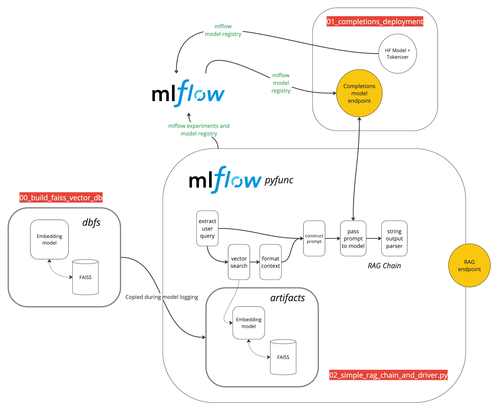

# Overview
This demo highlights how to use build a RAG chain using a FAISS database. The repo contains one config (`rag_chain_config.yaml`) file and three notebooks to deploy a parameterized RAG chain. The three notebooks are:
1. Vector index notebook (`00_build_faiss_vector_db`)
2. Completions model deployment notebook (`01_completions_deployment`)
3. Chain notebook (`02_simple_rag_chain_and_driver`)

The diagram below highlights how all three files are linked together to deploy a RAG chain

## Usage
There are three simple steps:
1. Modify the `rag_chain_config.yaml` to use your specific embedding models and cache directories. Note there may be some unused parameters. 
2. Run the `00_build_faiss_vector_db.py` notebook to build a FAISS vector DB and store it in DBFS.
3. Run the `01_completions_deployment` notebook to deploy a completions model with provisioned throughput. Note that you may have to make some adjustments to this for your desired throughput. 
3. The `02_simple_rag_chain_and_driver.py` notebook builds, logs, registers, and deploys your RAG chain. It connects your RAG chain to your completions endpoint and pulls the vector database from DBFS into the model artifacts to be used during inference. 