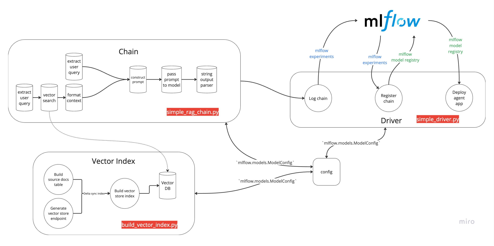

# Overview
This demo highlights how to use parameterized config files to generate a RAG chatbot on Databricks Documentation. The repo contains one config (`rag_chain_config.yaml`) file and three notebooks to deploy a parameterized RAG agent. The three notebooks are:
1. Vector index notebook (`build_vector_index.py`)
2. Chain notebook (`simple_rag_chain.py`)
3. Driver notebook (`simple_driver.py`)

The diagram below highlights how all three files are linked together to deploy a RAG agent with a Review application. 

## Usage
There are three simple steps:
1. Modify the `rag_chain_config.yaml` to use your specific catalog, database, table names, and model names. 
2. Run the `build_vector_index.py` notebook to populate source docs into a delta table, create a vector store endpoint, and finally create a vector index. 
3. Run the `simple_driver.py` notebook. This notebook logs the chain (`simple_rag_chain.py`) and configuration file (`rag_chain_config.yaml`) into MLflow, registers the model, and then deploys a chatbot with review app attached to it. 

Note that this demo is forked from this [notebook](https://notebooks.databricks.com/demos/llm-rag-chatbot/index.html). I abstracted out the various components of the RAG chain, and modified it so everything would use one single configuration file for parameterization.